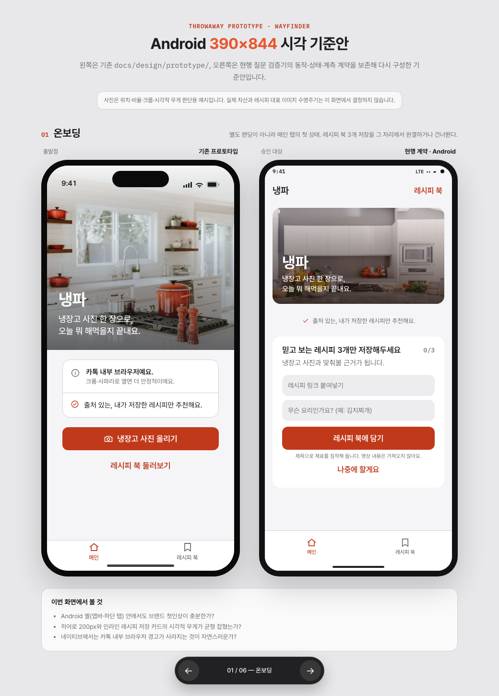
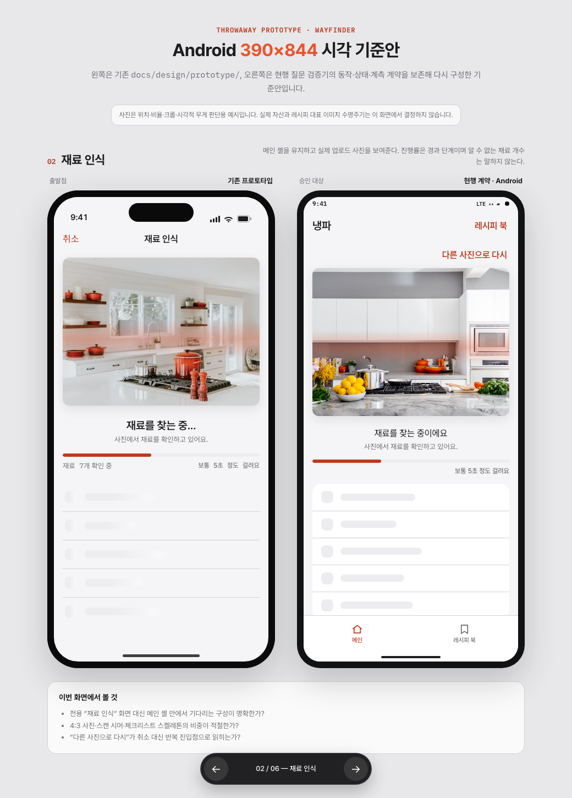
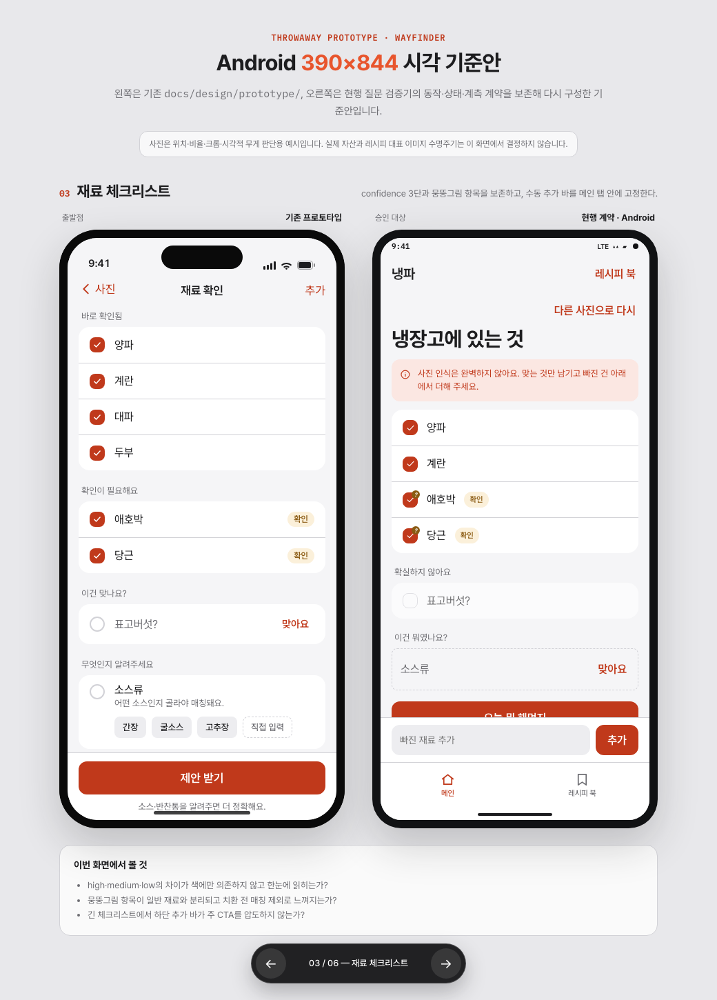
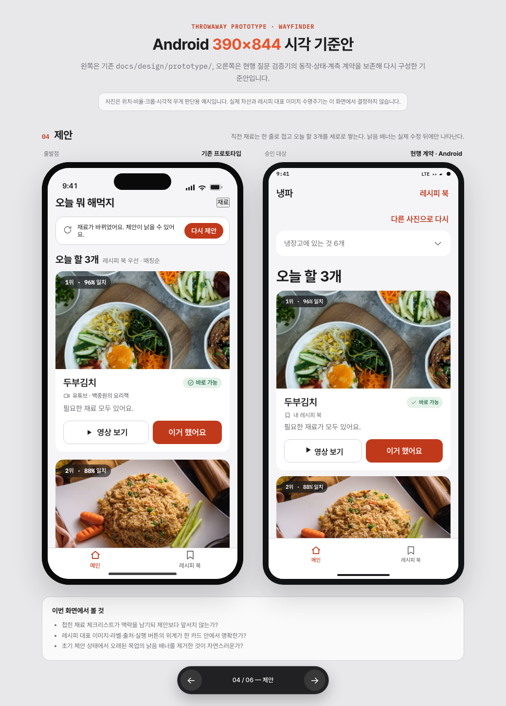
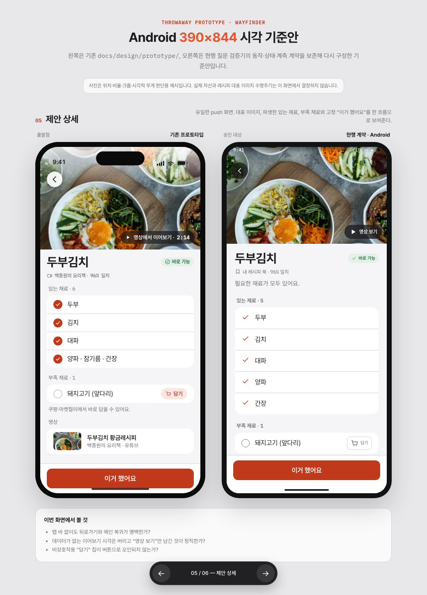
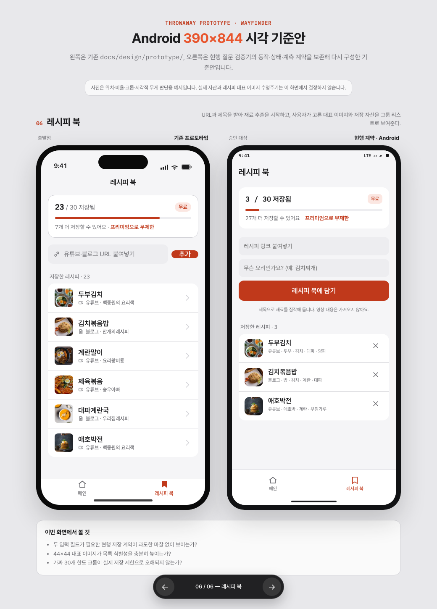

<!-- 승인된 Android 390×844 비교 기준본을 재현하고 검토 결과를 찾는 폐기용 프로토타입 안내. -->
# Android 390×844 시각 기준본 프로토타입

`docs/design/prototype/`의 기존 6화면과 현행 질문 검증기 계약을 반영한 Android 기준안을 나란히 비교한다. 파운더가 2026-07-31 승인했다.

이 브랜치는 결정의 1차 자료를 보존하는 throwaway 자산이다. 제품 코드로 승격하지 않는다. 사진은 위치·비율·크롭·시각적 무게를 판단하기 위한 예시이며 실제 자산이나 레시피 대표 이미지 수명주기를 결정하지 않는다.

## 실행

리포 루트에서 다음 한 명령으로 정적 서버를 연다.

```bash
python3 -m http.server 8777 --directory .
```

그 뒤 `http://localhost:8777/docs/design/prototype-android-baseline/index.html?screen=onboarding`을 열고 화면 하단 화살표 또는 키보드 ←/→로 6화면을 넘긴다.

## 승인 캡처

| 화면 | 기존 프로토타입 ↔ 승인 Android 기준안 |
| --- | --- |
| 온보딩 |  |
| 재료 인식 |  |
| 재료 체크리스트 |  |
| 제안 |  |
| 제안 상세 |  |
| 레시피 북 |  |
